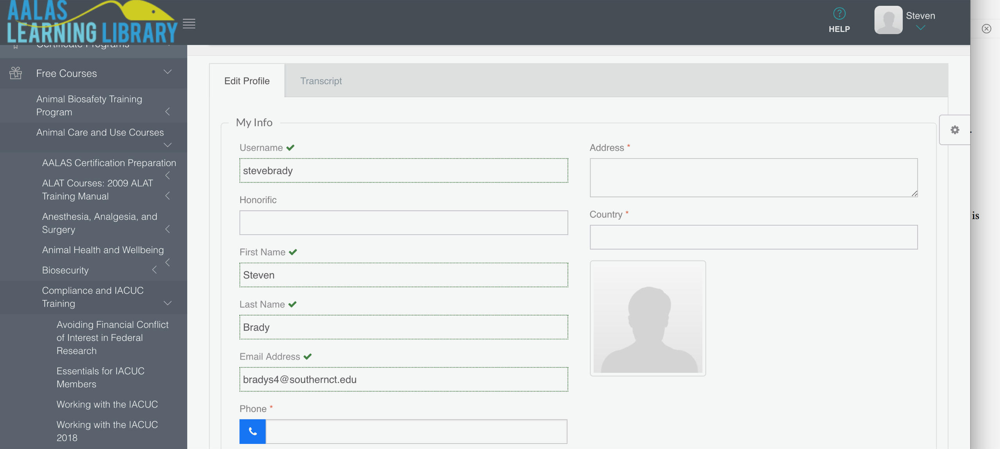
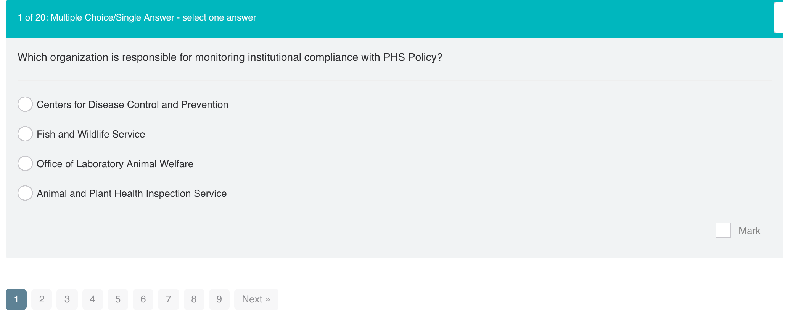

```{r setup, include=FALSE}
knitr::opts_chunk$set(echo = TRUE)
```

# IACUC Training
Be aware that signing up for the course is not a particularly straightforward process. Here is what worked for me:

- go here: https://aalaslearninglibrary.org/
- Click ‘try it for free’
- Sign up (choosing the limited access single user free version)
- Create a profile
- Update your profile (not sure this is necessary but I had to do it)
- navigate to the ‘Working with the IACUC 2018’ link (see image below, last link on bottom left of image)

- begin training 
- take and pass the exam (You can take it multiple times, until you pass, I believe)
- **TAKE A SCREENSHOT OF YOUR SCORES at the end of the exam and email it to me. This last step is key!**
- Pro tip: On the exam, be sure you click the little ‘Mark’ box for question you respond to (located in the lower right of each question — see screenshot below). Otherwise, your response is not counted and you will get that question wrong. Don’t ask me how I know this..




